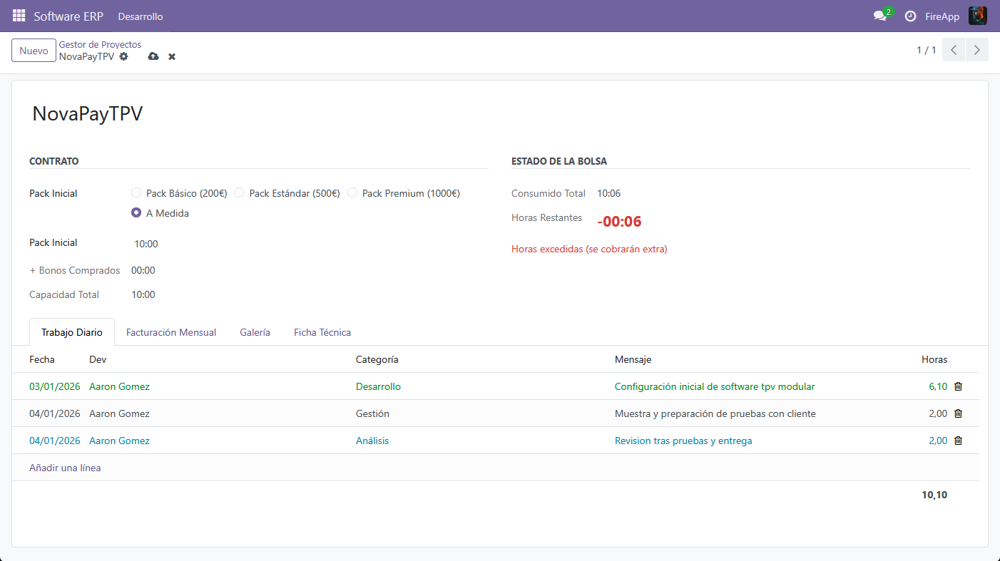
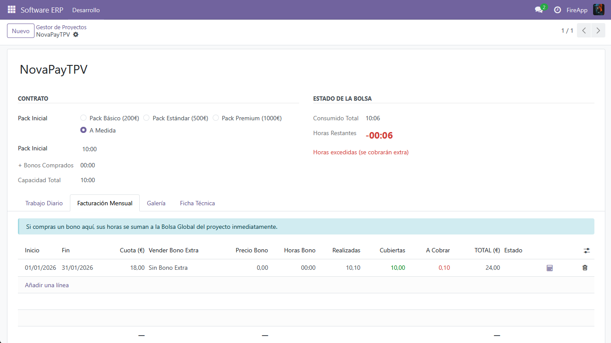

# 🚀 FireApp ERP - Gestión de Proyectos de Software (Odoo 18)


**FireApp ERP** es un módulo personalizado para Odoo 18 diseñado específicamente para **empresas de desarrollo de software**. Permite gestionar el ciclo de vida económico completo de un proyecto: desde la venta del paquete de horas inicial hasta la imputación diaria de trabajo y la facturación recurrente mensual.

---

## ✨ Características Principales

### 1. Gestión de Contratos y Packs
- **Packs Predefinidos:** Selección rápida de contratos (Básico, Estándar, Premium) con precios y horas autocompletadas.
- **Configuración a Medida:** Posibilidad de definir precios personalizados por proyecto.
- **Cuota de Mantenimiento:** Gestión de fees mensuales recurrentes.

### 2. Control de Bolsa de Horas (Semáforo)
- **Visualización en Tiempo Real:** Indicador visual que muestra el saldo de horas disponibles.
  - 🟢 **Verde:** Horas disponibles (Pack Inicial + Bonos).
  - 🔴 **Rojo:** Horas excedidas (se cobrarán como extra).
- **Cálculo Global:** Suma inteligente de horas del contrato inicial + bonos comprados en facturas mensuales.

### 3. Registro de Trabajo (Commits)
- Imputación de horas por categoría:
  - 🛠️ Desarrollo
  - 📋 Análisis
  - 🧪 QA / Pruebas
  - 🔧 Mantenimiento
- Cálculo automático de costes basado en la tarifa por hora del proyecto.

### 4. Facturación Mensual Inteligente 🧮
- **Calculadora Automática:** Genera el importe a facturar teniendo en cuenta:
  - Cuota mensual de mantenimiento.
  - Venta de **Bonos de Horas Extra** (se suman automáticamente a la bolsa global).
  - Cobro de horas sueltas si se ha excedido la bolsa.
- Historial de liquidaciones por mes.

### 5. Interfaz Mejorada
- Vista de **Galería** con zoom para capturas de pantalla del software.
- Listas editables con colores condicionales según el estado.

---

## 📸 Capturas de Pantalla

| Ficha de Proyecto | Facturación Mensual |
|:---:|:---:|
|  |  |
*(Reemplaza estos enlaces con tus capturas reales en la carpeta /static/description/ o súbelas al repo)*

---

## 🛠️ Instalación

### Requisitos Previos
- Servidor Odoo 18.0 (Community o Enterprise).
- Python 3.10+.

### Pasos
1. **Clonar el repositorio** en tu carpeta de addons personalizados:
   ```bash
   cd /opt/odoo18/odoo/custom
   git clone [https://github.com/tu_usuario/software_erp.git](https://github.com/tu_usuario/software_erp.git)
