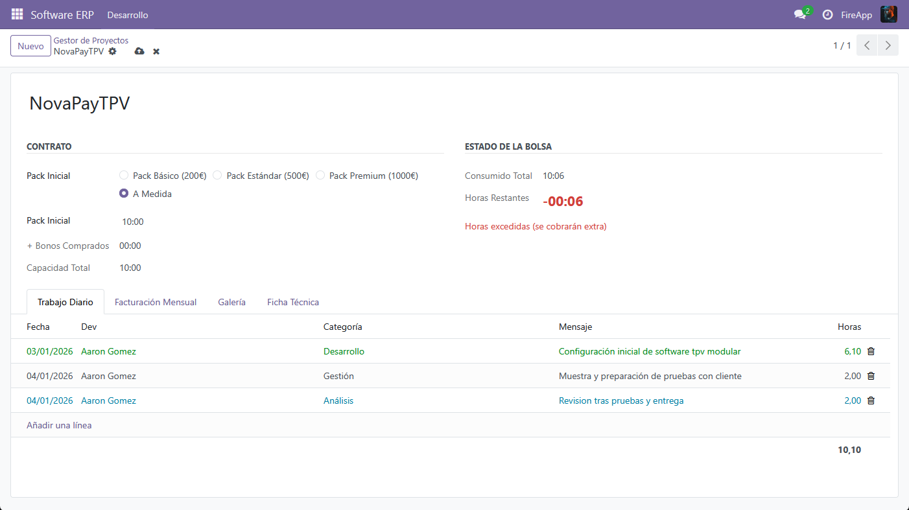
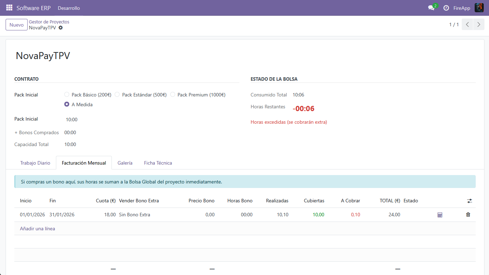

```
# 🚀 FireApp ERP - Gestión de Proyectos de Software (Odoo 18)


**FireApp ERP** es un módulo personalizado para Odoo 18 diseñado específicamente para **empresas de desarrollo de software**. Permite gestionar el ciclo de vida económico completo de un proyecto: desde la venta del paquete de horas inicial hasta la imputación diaria de trabajo y la facturación recurrente mensual.

📖 **Manual Interactivo y Documentación:** [odoo-gestion-manual.vercel.app](https://odoo-gestion-manual.vercel.app/)

---

## ✨ Características Principales

### 1. Gestión de Contratos y Packs
- **Packs Predefinidos:** Selección rápida de contratos (Básico, Estándar, Premium) con precios y horas autocompletadas.
- **Configuración a Medida:** Posibilidad de definir precios personalizados por proyecto.
- **Cuota de Mantenimiento:** Gestión de fees mensuales recurrentes.

### 2. Control de Bolsa de Horas (Semáforo)
- **Visualización en Tiempo Real:** Indicador visual que muestra el saldo de horas disponibles.
  - 🟢 **Verde:** Horas disponibles (Pack Inicial + Bonos).
  - 🔴 **Rojo:** Horas excedidas (se cobrarán como extra).
- **Cálculo Global:** Suma inteligente de horas del contrato inicial + bonos comprados en facturas mensuales.

### 3. Registro de Trabajo (Commits)
- Imputación de horas por categoría:
  - 🛠️ Desarrollo
  - 📋 Análisis
  - 🧪 QA / Pruebas
  - 🔧 Mantenimiento
- Cálculo automático de costes basado en la tarifa por hora del proyecto.

### 4. Facturación Mensual Inteligente 🧮
- **Calculadora Automática:** Genera el importe a facturar teniendo en cuenta:
  - Cuota mensual de mantenimiento.
  - Venta de **Bonos de Horas Extra** (se suman automáticamente a la bolsa global).
  - Cobro de horas sueltas si se ha excedido la bolsa.
- Historial de liquidaciones por mes.

### 5. Interfaz Mejorada
- Vista de **Galería** con zoom para capturas de pantalla del software.
- Listas editables con colores condicionales según el estado.

---

## 📸 Capturas de Pantalla

| Ficha de Proyecto | Facturación Mensual |
|:---:|:---:|
|  |  |

---

## 🛠️ Instalación

### Requisitos Previos
- Servidor Odoo 18.0 (Community o Enterprise).
- Python 3.10+.

### Pasos
1. **Clonar el repositorio** en la carpeta de addons personalizados:
   cd /opt/odoo18/odoo/custom
   git clone https://github.com/AaronSGomez/software_erp.git

2. **Reiniciar el servicio de Odoo** para cargar el nuevo módulo:
   sudo systemctl restart odoo18.service

3. **Actualizar la lista de aplicaciones** en Odoo:
   - Activa el *Modo Desarrollador* (Ajustes ➡️ Activar modo desarrollador).
   - Ve al menú superior *Aplicaciones* ➡️ *Actualizar lista de aplicaciones*.
   - Confirma el diálogo de actualización.
   - En la barra de búsqueda, escribe **"FireApp ERP"**.
   - Haz clic en el botón **Instalar** (o **Actualizar** si ya lo tenías).

---

## 📂 Estructura del Proyecto

Este módulo sigue la estructura estándar de Odoo 18:

software_erp/
├── __init__.py              # Inicializador del paquete Python
├── __manifest__.py          # Metadatos, dependencias y carga de archivos
├── models/                  # Lógica de Negocio (Tablas BBDD)
│   ├── __init__.py
│   └── software_module.py   # Clases: Proyectos, Commits, Liquidaciones
├── views/                   # Interfaz de Usuario (XML)
│   └── software_views.xml   # Formularios, Listas, Menús y Acciones
├── security/                # Seguridad y Permisos
│   └── ir.model.access.csv  # ACLs (Listas de Control de Acceso)
├── demo/                    # Datos de Demostración
│   └── demo_data.xml        # Proyectos, facturas y commits de ejemplo
└── static/
    └── description/         # Recursos estáticos (Icono del módulo)

---

## 👤 Autor

**Aarón Gómez Abella**
- 🌐 [Portfolio Personal](https://www.aaronsgomez.es/)
- 🐙 [GitHub Profile](https://github.com/AaronSGomez)
- 💼 [LinkedIn](https://www.linkedin.com/in/aaronsgomez/))

---

## 📄 Licencia

Este proyecto se distribuye bajo la licencia **LGPL-3** (GNU Lesser General Public License v3.0). Consulta el archivo `LICENSE` para más información.

```
